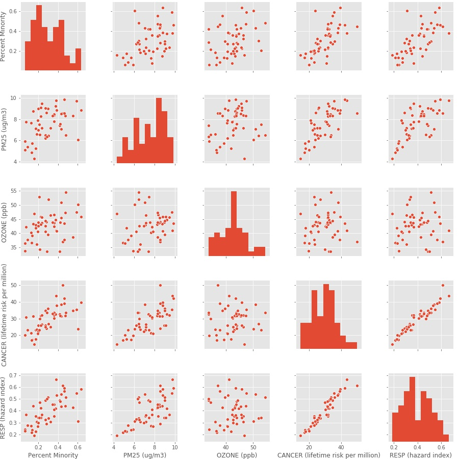

# Air Toxics in US Communities

# Overview
This project will explore measured PM 2.5 and Ozone concentrations in the air, along with lifetime cancer risk and respiratory hazard index in communities in the US, based on an EPA dataset broken down locations by census tract and block group.  This project will also explore the measured proximity to toxic or hazardous facilities, along with the percent minority population, in each census tract block group.  Each of the mentioned environmental-health indicators speaks to the health of a community, and this project will explore environmental health inequities based on a community's minority population.

# Questions
Questons I'd like to Explore:
- How do PM 2.5 and ground level ozone concentrations vary in different communities in the US? How is this related to the percentage of minorit
y residents in a community? 
- How does the respiratority hazard and cancer risk due to toxic air pollutants vary in different communities in the US? In what ways are high minority communities at greater risk to cancer and respiratory diseases in the US due to air pollution?
- How does the proximity to toxic and hazardous facilities vary in different communities in the US? Do communities with high minority populations have more hazardous facilities in their proximity?

# Data
The data that was used for this investigation came from the EPA 2019 EJSCREEN dataset: ftp://newftp.epa.gov/EJSCREEN/

The raw dataset had 220333 entries, each entry corresponding to a US census tract block group, and 128 columns, each corresponding to an environmental health or demographic indicator. 

The indicators that I focused on in my analysis are listed below, including their definitions:

- Census Tract: a 6-digit code used to identify geographic entities within counties
- Block Group: a subgroup of a census tract, identified by a 2-digit code, most often following a census tract number
- Percent Minority: the percentage of people in a census tract block group who listed on their census their racial status as a race other than white alone and/or listed their ethnicity as Hispanic or Latino 
- PM25 (ug/m3): fine particulate matter in the air, measured in micrograms per cubic meter
- OZONE (ppb): ground level ozone concentration, measured in parts per billion
- RESP (hazard risk): respiratory hazard risk, measured as a ratio of exposure concentration to health-based reference concentration
- CANCER (lifetime risk per million): lifetime cancer risk from inhalation of air toxics, measured as the number of people per 1 million who will get cancer in their lifetime from inhalation of air toxics
- Total Toxic Facilities (facilities/km distance): the sum of national priorities list sites, risk management sites, and hazardous waste facilities for a block group, divided by the distance in kilometers, for all sites within 5 km 

# Exploratory Data Analysis

I began by exploring the data from all the block groups in the US. Since there were so many data points, more than 200,000, it first broke down the data by state to look for trends. I started by looking at the mean values of each state in a scatter matrix and correlation matrix:

I looked at the correlation matrix for the data from all block groups as well, which seemed to follow similar trends.

Based on the correlation data, I decided to further explore the relationship between percent minority and each of the selected environmental health indicators. I first decided to do this by breaking down the block group data into 4 groups: 
- 0-25% minority population
- 25-50% minority population
- 50-75% minority population
- 75-100% minority population. 

I created a normalized histogram for each of these different percent minority groups, for each of the environmental indicators (Ozone, PM 2.5, cancer risk, resperatory hazard index, and proximity to toxic facilities) to visualize the distributions.

These distributions all showed that there is likely some trend toward higher environmental indicator levels (Ozone, PM 2.5, cancer risk, respiratory hazard index, and proximaty to toxic facilities) in block groups with a higher minority population. I decided to further investigate each of these trends with a hypothesis test. 

I set up my hypothesis tests by breaking the population into two groups, "low-minority" block groups and "high-minority" block groups, split above and below the median minority percent of the block group data. Each sample was about ~100,000 block groups. My null hypothesis in each case was that the mean environmental indicator value of the low minority block groups was equal to the mean environmental indicator value of the high minority block groups. My alternate hypothesis was that the mean indicator value of the high minority block groups was greater than that of the low minority block groups.  

Below is a visualization of the distrubtion of the Respiratory Hazard Index in the two groups that were compared in a hypothesis test. 

The graph above shows that there is a bit of a tail and the mean of each sample is not centered at the peak of the corresponding distribution. Because of this, I could only assume a normal distribution if the sample size was very large and I was comparing means.  In this case, the sample size was about 100,000 and I was comparing means, so I could assume a normal distribution and use a T-Test to find a p-value to test my hypothesis.  In this case, I also tested each of these using a U-Test to confirm my findings and my assumption of normality for the large sample size.  With both the T-Test and the U-Test, assuming a 95% confidence interval, a two-tail test gave me a p-value of 0, which allowed me to reject the null hypothesis.  To further support my rejection of the null hypothesis, I noted the large effect size relative to the sample means, as well as the low standard error of each of the samples.

# Conclusions

#### summary of findings

#### Summary Statistics

#### Why it does (or doesn't) matter

# Hypothesis Testing
- For each of the tests listed below, I broke the population into two groups, "low-minority" groups and "high-minority" groups, split below and above the median of the block group data. Each sample size was ~100,000.
- I found the mean environmental index value of each group, and used both a T-Test and a U-Test to measure the p-value. 
- I used the U-Test, since the distribution of the environmental index values of each sample had a long tail and looked non-normal, with the peak not aligned to the mean value. The T-Test would also be valid in this case, even if the distribution could not be assumed to be normal, since I was comparing the mean of each group and the sample size was so large (>100,000).

#### 1. Is there a difference in the average respiratory hazard index in low minority groups and high minority block groups?

Null Hypothesis: H_0
- The average respiratory hazard index in low minority groups is equal to the average respiratory hazard index in high minority groups.

Alternate Hypothesis: H_a
- The average respiratory hazard index in high minority groups is greater than the average respiratory hazard index in low minority groups.

Significance Level 
- 95% confidence interval

Results
- Both the T-Test and U-Test gave a p-value of 0, which, assuming a 95% confidence interval, allowed me to reject the null hypothesis. 
- Looking at the large effect size, relative to the sample means, as well as the low standard error of the samples, provided additional supporting evidence to reject the null hypothesis in each of the cases below.

#### 2. Is there a difference in the average cancer risk in low minority groups and high minority block groups?

Null Hypothesis: H_0
- The average cancer risk in low minority groups is equal to the average cancer risk in high minority groups.

Alternate Hypothesis: H_a
- The average cancer risk in high minority groups is greater than the average cancer risk in low minority groups.

Significance Level 
- 95% confidence interval

Results
- Both the T-Test and U-Test gave a p-value of 0, which, assuming a 95% confidence interval, allowed me to reject the null hypothesis. 
- Looking at the large effect size, relative to the sample means, as well as the low standard error of the sample, provided additional supporting evidence to reject the null hypothesis in each of the cases below.

#### 3. Is there a difference in the average PM 2.5 concentrations in low minority groups and high minority block groups?

Null Hypothesis: H_0
- The average PM 2.5 concentrations in low minority groups is equal to the average PM 2.5 concentrations in high minority groups.

Alternate Hypothesis: H_a
- The average PM 2.5 concentrations in high minority groups is greater than the average PM 2.5 concentrations in low minority groups.

Significance Level 
- 95% confidence interval

Results
- Both the T-Test and U-Test gave a p-value of 0, which, assuming a 95% confidence interval, allowed me to reject the null hypothesis. 
- Looking at the large effect size, relative to the sample means, as well as the low standard error of the sample, provided additional supporting evidence to reject the null hypothesis in each of the cases below.

#### 4. Is there a difference in the average ground-level Ozone concentrations in low minority groups and high minority block groups?

Null Hypothesis: H_0
- The average Ozone concentration in low minority groups is equal to the average Ozone concentration in high minority groups.

Alternate Hypothesis: H_a
- The average Ozone concentration in high minority groups is greater than the average Ozone concentration in low minority groups.

Significance Level 
- 95% confidence interval

Results
- Both the T-Test and U-Test gave a p-value of nearly 0.  
- In this case I was not able to reject the null hypothesis after taking a closer look at the effect size relative to the sample means as well as the standard error of the samples. The effect size was only about 2% of the mean, and the standard error was about one one hundredth of the effect size.

#### 5. Is there a difference in the average proximity to hazardous or toxic facilities  in low minority groups and high minority block groups?

Null Hypothesis: H_0
- The average toxic facilities per km in low minority groups is equal to the average toxic facilities per km in high minority groups.

Alternate Hypothesis: H_a
- The average toxic facilities per km in high minority groups is greater than the average toxic facilities per km in low minority groups.

Significance Level 
- 95% confidence interval

Results
- Both the T-Test and U-Test gave a p-value of 0, which, assuming a 95% confidence interval, allowed me to reject the null hypothesis. 
- Looking at the large effect size, relative to the sample means, as well as the low standard error of the sample, provided additional supporting evidence to reject the null hypothesis in each of the cases below.

# Next Steps

One thing I noticed in the data is a strong difference in the trends in the subset of Alameda county data versus the trends in the US or even just in the state of California.

I noticed in the scatter matrix and correlation matrix that there were some negative-leaning associations between minority percent and the environmental indicators (see figure below). 

alameda county correlation matrix:

One positive-looking association was between "percent minority" and "RESP (hazard index)", so I decided to look into these further. I conducted one hypothesis test on Alameda county, again by breaking the data apart into subgroups "low minority" block groups and "high minority" block groups, based on the median percent minority in Alameda County. I investigated the question of whether low-minority block groups have a higher average respiratory hazard index than high-minority block groups in Alameda county:

- Null Hypothesis: H_0
    - In Alameda County, the average respiratory hazard index in low minority block groups is equal to the average respiratory hazard index in high minority block groups.

- Alternate Hypothesis: H_a
    - In Alameda County, the average respiratory hazard index in high minority block groups is greater than the average respiratory hazard index in low minority block groups.

- In this case, I used a U-test in this case since the sample size was only 1000 and I couldn't assume a normal distribution based on the density plot. I found a p-value of .292, which did not allow me to reject the null hypothesis in this case, assuming a 95% confidence interval. 
- Looking at the density plot below, you can also see that the average mean in low-minority block groups is higher than the average mean in high-minority block groups, which is opposite of the trend observed when looking at data for the whole state of California or the whole US. In this case, however, the effect size was less than 1 percent of the mean, and the standard error was nearly as large as the effect size, so, again I cannot reject the null hypothesis in this case. 

As a next step, I would like to look into comparing Alameda County along with other counties in California. 

I began to look into the data further by looking at the Alameda County distribution compared to other counties in California:

county box plots:

I also looked at these environmental health indicators compared to minority percentage among all the counties in California:

To better understand these trends, a next step would be conducting hypothesis testing at the county level, related to these indicators. 

# Sources

