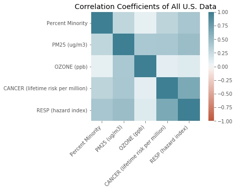
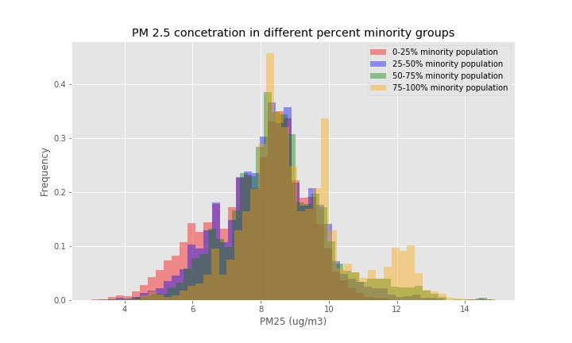
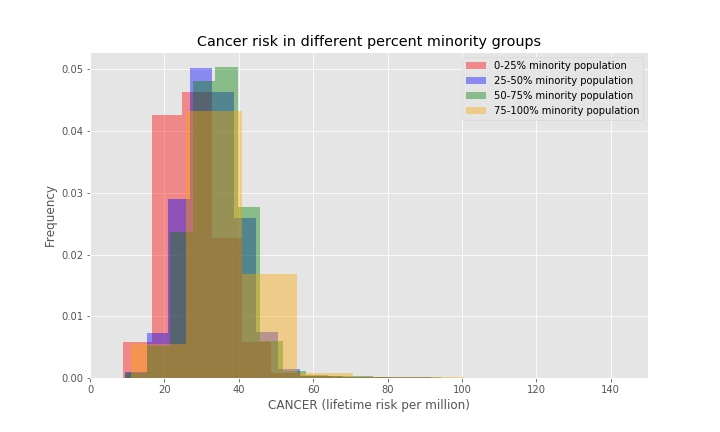
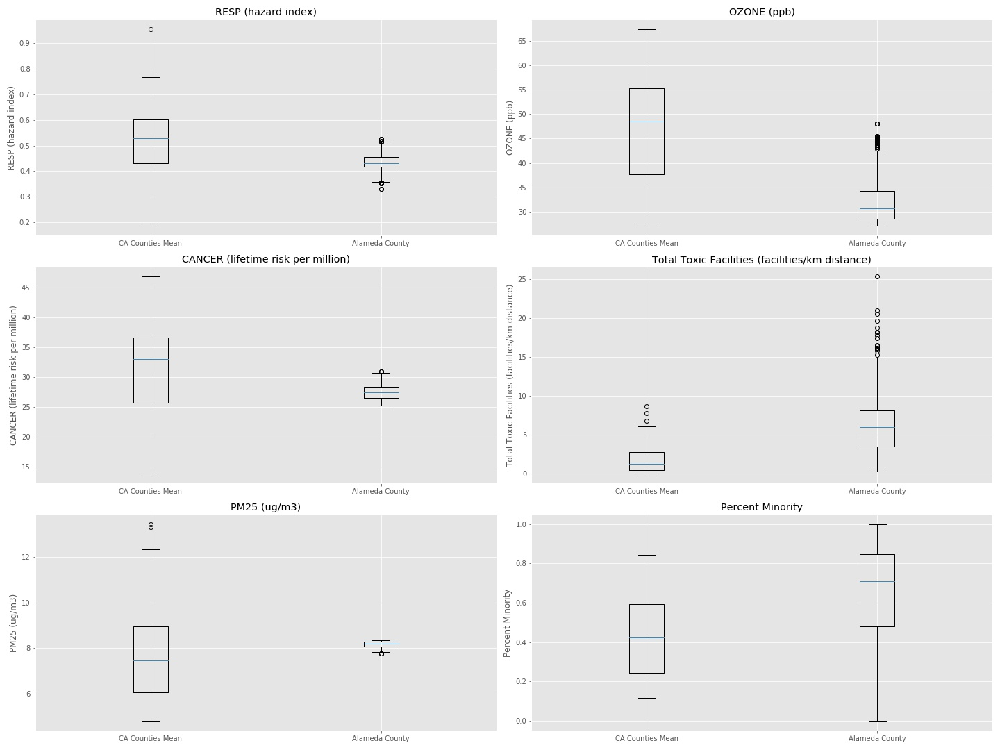

# Air Toxics in US Communities

# Overview
This project will explore measured PM 2.5 and Ozone concentrations in the air, along with lifetime cancer risk and respiratory hazard index in communities in the US and percent minority population, based on an EPA dataset broken down by census tract and block group. Each of the mentioned environmental-health indicators speaks to the health of a community, and this project will explore environmental health inequities based on a community's minority population.

# Questions
Questons I'd like to Explore:
- How do PM 2.5 and ground level ozone concentrations vary in different communities in the US? How is this related to the percentage of minority residents in a community? 
- How does the respiratory hazard and cancer risk due to toxic air pollutants vary in different communities in the US? In what ways are high minority communities at greater risk to cancer and respiratory diseases in the US due to air pollution?

# Data
The data that was used for this investigation came from the EPA 2019 EJSCREEN dataset: ftp://newftp.epa.gov/EJSCREEN/

The raw dataset had 220333 entries, each entry corresponding to a US census tract block group, and 128 columns, each corresponding to an environmental health or demographic indicator. 

The indicators that I focused on in my analysis are listed below, including their definitions:

- Census Tract: a 6-digit code used to identify geographic entities within counties
- Block Group: a subgroup of a census tract, identified by a 2-digit code, most often following a census tract number
- Percent Minority: the percentage of people in a census tract block group who listed on their census their racial status as a race other than white alone and/or listed their ethnicity as Hispanic or Latino 
- PM25 (ug/m3): fine particulate matter in the air, measured in micrograms per cubic meter
- OZONE (ppb): ground level ozone concentration, measured in parts per billion
- RESP (hazard risk): respiratory hazard risk, measured as a ratio of exposure concentration to health-based reference concentration
- CANCER (lifetime risk per million): lifetime cancer risk from inhalation of air toxics, measured as the number of people per 1 million who will get cancer in their lifetime from inhalation of air toxics

# Exploratory Data Analysis

I began by exploring the data from all the block groups in the US. Since there were so many data points, more than 200,000, I first broke down the data by state to look for trends. I started by looking at the mean values of each state in a scatter matrix and correlation matrix:

I looked at the correlation matrix for the data from all block groups as well, which seemed to follow similar trends though generally had weaker correlation coefficients.

Based on the correlation data, I decided to further explore the relationship between percent minority and each of the selected environmental health indicators. I first decided to do this by breaking down the block group data into 4 groups: 
- 0-25% minority population
- 25-50% minority population
- 50-75% minority population
- 75-100% minority population. 

I created a normalized histogram for each of these different percent minority groups, for each of the environmental indicators (Ozone, PM 2.5, cancer risk, and resperatory hazard index) to visualize the distributions.

These distributions all showed that there is likely some trend toward higher environmental indicator levels (Ozone, PM 2.5, cancer risk, and respiratory hazard index) in block groups with a higher minority population. I decided to further investigate each of these trends with a hypothesis test. 

# Hypothesis Testing

- I set up my hypothesis tests by breaking the population into two groups, "low-minority" block groups and "high-minority" block groups, split above and below 50% minority population. The low-minority sample size was 148,979, and the high-minority sample size was 66,276. My null hypothesis in each case was that the mean environmental indicator value of the low minority block groups was equal to the mean environmental indicator value of the high minority block groups. My alternate hypothesis was that the mean indicator value of the high minority block groups was greater than that of the low minority block groups.  
- I found the mean environmental index value of each group, and used  a U-Test to measure the p-value to compare against a 95% confidence interval. 
- I used the U-Test, since the distribution of the environmental index values of each sample had a long tail and looked non-normal, with the peak not aligned to the mean value. The T-Test would also be valid in this case, even if the distribution could not be assumed to be normal, since I was comparing the mean of each group and the sample size was so large (~100,000). The T-Test gave the same p-values as listed below.

### 1. Is there a difference in the average respiratory hazard index in low minority groups and high minority block groups?

Null Hypothesis: H_0
- The average respiratory hazard index in low minority groups is equal to the average respiratory hazard index in high minority groups.

Alternate Hypothesis: H_a
- The average respiratory hazard index in high minority groups is greater than the average respiratory hazard index in low minority groups.

#### Results

Mean:
- Low minority RESP hazard index: 0.400
- High minority RESP hazard index: 0.509

Effect size: 
- 0.109

U-test: 
- The U-Test gave a p-value of 0.0, which, assuming a 95% confidence interval, allowed me to reject the null hypothesis and accept the alternate hypothesis that the average resperatory hazard index was greater in high minority block groups.
- Looking at the large effect size, relative to the sample means, as well as the low standard error of the samples, provided additional supporting evidence to reject the null hypothesis and accept the alternate hypothesis that the average respiratory hazard index is greater in the high minority population block groups.

### 2. Is there a difference in the average PM 2.5 concentrations in low minority groups and high minority block groups?

Null Hypothesis: H_0
- The average PM 2.5 concentrations in low minority groups is equal to the average PM 2.5 concentrations in high minority groups.

Alternate Hypothesis: H_a
- The average PM 2.5 concentrations in high minority groups is greater than the average PM 2.5 concentrations in low minority groups.

#### Results

Mean:
- Low minority RESP hazard index: 7.979
- High minority RESP hazard index: 8.819

Effect size: 
- 0.840

U-test: 
- The U-Test gave a p-value of 0.0, which, assuming a 95% confidence interval, allowed me to reject the null hypothesis and accept the alternate hypothesis that the average PM 2.5 concentration is greater in high minority block groups.

### 3. Is there a difference in the average cancer risk in low minority groups and high minority block groups?

Null Hypothesis: H_0
- The average cancer risk in low minority groups is equal to the average cancer risk in high minority groups.

Alternate Hypothesis: H_a
- The average cancer risk in high minority groups is greater than the average cancer risk in low minority groups.

#### Results

Mean:
- Low minority RESP hazard index: 26.621
- High minority RESP hazard index: 35.787

Effect size: 
- 0.165

U-test: 
- The U-Test gave a p-value of 0.0, which, assuming a 95% confidence interval, allowed me to reject the null hypothesis and accept the alternate hypothesis that the average cancer risk is greater in high minority block groups.

### 4. Is there a difference in the average ground-level Ozone concentrations in low minority groups and high minority block groups?

Null Hypothesis: H_0
- The average Ozone concentration in low minority groups is equal to the average Ozone concentration in high minority groups.

Alternate Hypothesis: H_a
- The average Ozone concentration in high minority groups is greater than the average Ozone concentration in low minority groups.

#### Results

Mean:
- Low minority RESP hazard index: 42.628
- High minority RESP hazard index: 43.635

Effect size: 
- 1.007

U-test: 
- The U-Test gave a p-value of 3.4*10^-28, nearly 0. 
- In this case I was not able to reject the null hypothesis after taking a closer look at the effect size relative to the sample means as well as the standard error of the samples. The effect size was only about 2% of the mean, and the standard error was about one one-hundredth of the effect size.

# Summary of Results

#### With 95% confidence, we accept that:
- The average respiratory hazard index is greater in high minority block groups compared to low minority block groups
- The average PM 2.5 concentration is greater in high minority block groups compared to low minority block groups
- The average cancer risk is greater in high minority block groups compared to low minority block groups

#### With 95% confidence, we are unable to reject that:
- The average Ozone concentration is the same in low minority and high minority block groups

# Next Steps

One thing I noticed in the data is a strong difference in the trends in the subset of Alameda county data versus the trends in the US or even just in the state of California.

I noticed in the scatter matrix and correlation matrix that there were some negative-leaning associations between percent minority and the environmental indicators, as shown below. 

One positive-looking association was between "percent minority" and "RESP (hazard index)", so I decided to look into these further. I conducted one hypothesis test on Alameda county, again by breaking the data apart into subgroups "low minority" block groups and "high minority" block groups, as shown below:

Null Hypothesis: H_0
- In Alameda County, the average respiratory hazard index in low minority block groups is equal to the average respiratory hazard index in high minority block groups.

Alternate Hypothesis: H_a
- In Alameda County, the average respiratory hazard index in high minority block groups is greater than the average respiratory hazard index in low minority block groups.

Results:
- In this case, I used a U-test in this case since the sample size was only 1000 and I couldn't assume a normal distribution based on the density plot. 
- I found a p-value of 0.074, which did not allow me to reject the null hypothesis in this case, assuming a 95% confidence interval. 

As a next step, I would like to look into comparing Alameda County along with other counties in California, based on the selected indicators. An intitial analysis is shown below, and a next step would be conducting hypothesis testing at the county level, related to these indicators.

